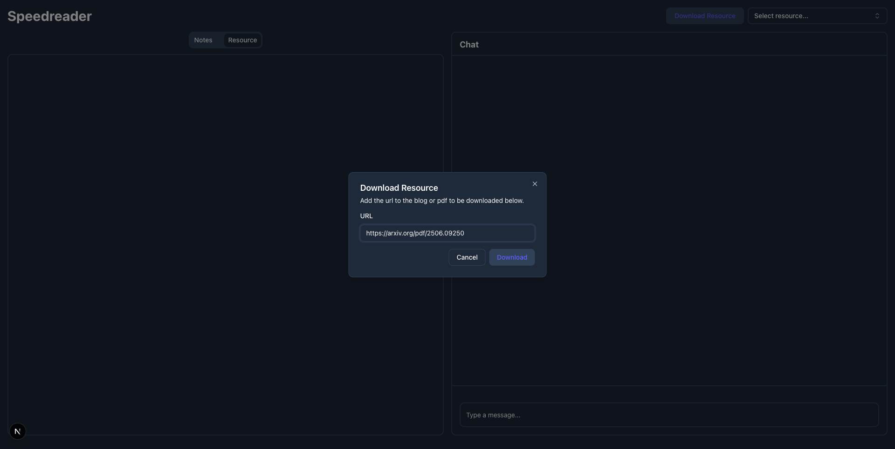
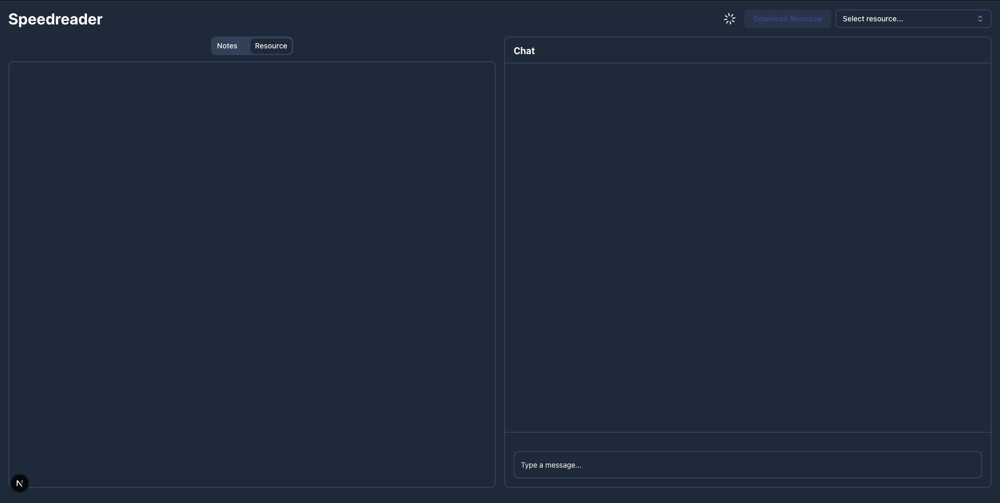
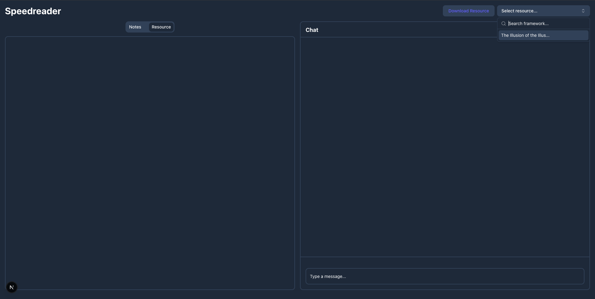
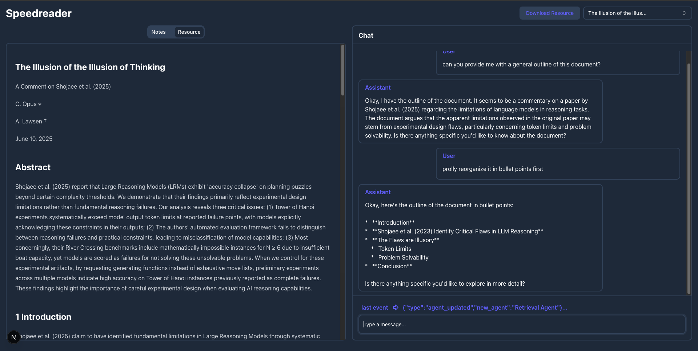
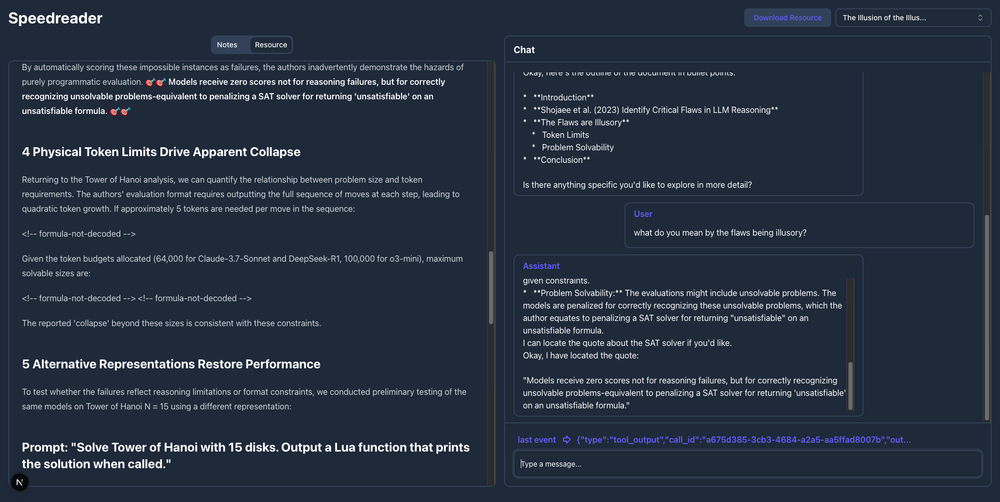
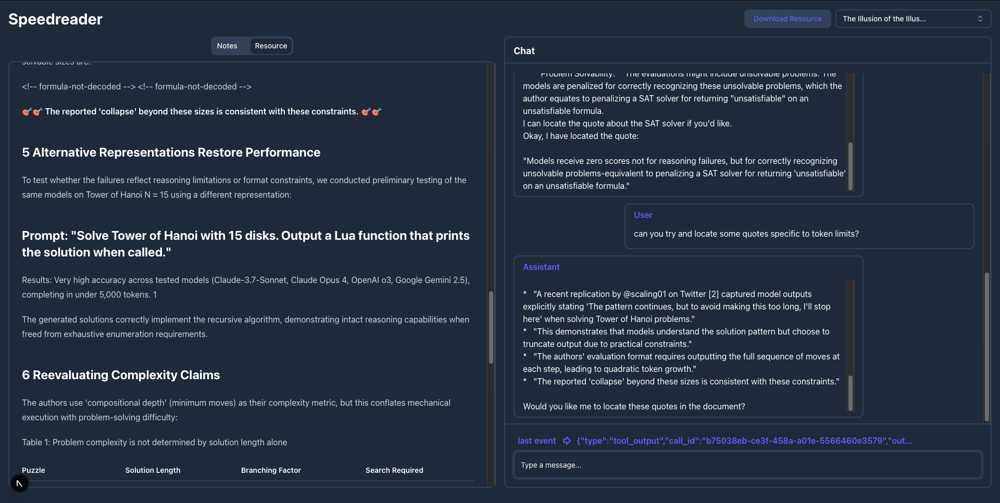
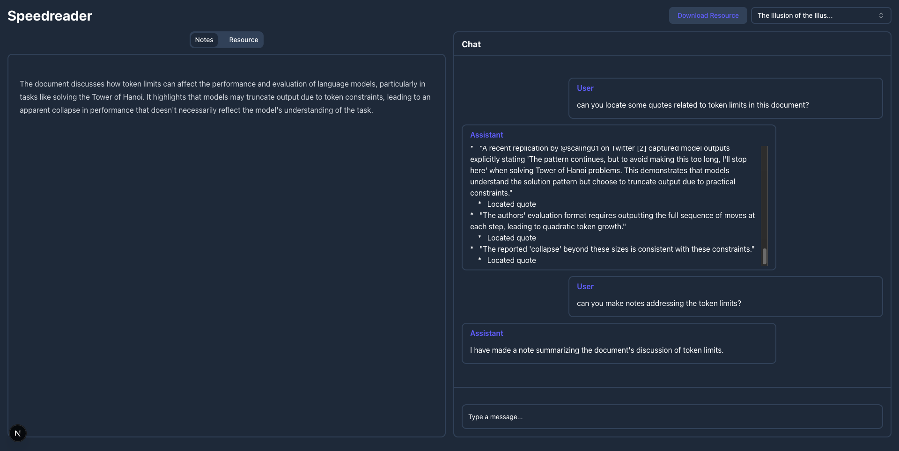

## Speedreader

This project comprises a speedreading application designed to help quickly process and comprehend documents. It consists of three main components which need to be set up before use.

### Speedreader (`speedreader/`):

This is a backend app with endpoints for interacting with the agent and various processing and storage steps.

**Endpoints:**
1. `GET /resource`: Lists resources (i.e. documents).
2. `GET /resource/{name}`: Get the contents of a particular resource.
3. `GET /notes/{name}`: Get the notes stored for a particular resource.
4. `POST /resource`:
    1. Download, process and store a new resource.
    2. Receives the `url`.
    3. Downloads the resource and saves to `speedreader/resources/{name}/content.md`.
    4. Generates an outline and saves to `speedreader/resources/{name}/outline.json` .
    5. Aligns the outline with quotes from the `content.md` and saves to `speedreader/resources/{name}/quotes.json`.
5. `POST /chat`:
    1. Interact with the agent.
    2. Receives `messages` and the `name` of the document.
    3. Passes it to the agent and streams back it's actions.

**Set Up:**
1. Install `uv`: `pip install uv`
2. Set up the venv: `uv venv`
3. Install dependencies: `uv sync`
4. `.env`: The format is the following,
    ```
    OPENAI_BASE_URL=http://127.0.0.1:5000
    OPENAI_API_KEY=abc
    OPENAI_AGENTS_DISABLE_TRACING=1
    ```


### Chat Server (`chat_server/`):

This is a proxy chat server for being able to use Gemini 2.0 Flash with the OpenAI Agents SDK, along with handling rate limits by pauses.

The only endpoint usable is `/chat/completions`.

**Set Up:**
1. Install `uv`: `pip install uv`
2. Set up the venv: `uv venv`
3. Install dependencies: `uv sync`
4. `.env`: The format is the following,
    ```
    GEMINI_API_KEY=<your-gemini-api-key>
    ```

### Speedreader Frontend (`speedreader-frontend/`):

This is the frontend app, with the document viewer and the chat interface.

Install dependencies using `npm i` to set up.


### Usage

Once all 3 apps are set up, they should be run as:

1. `speedreader/`: `uv run main.py`
2. `chat_server/`: `uv run main.py`
3. `speedreader-frontend/`: `npm run dev`

Then open up the browser at `http://localhost:3000/`.

1. **Downloading resources:**
    1. In order to download resources, click on the `Download Resource` button and pass in the URL of the resource to be downloaded.
        
    2. The resource can be a URL to any form of document that can be processed by [Docling](https://github.com/DS4SD/docling).
    3. Once you hit `Download`, there should be a loader indicating processing, reload the page once it's done.
        

2. **Selecting resource:** From the selector at the top right, choose the resource you want to read
    (in the above case it would have to be the one that was downloaded).
    

3. **Understand the resource:** A recommended first step is to ask for a general outline / structure of the document in order to understand everything covered at a high-level.
    

4. **Explore various aspects:**
    1. Based on the outline, you should have a decent idea of what's in the document.
    2. You should then try and explore various aspects of it which you'd like to understand further at a relatively deeper level.
    

5. **Locate quotes for deep reading:**
    1. A recommended next step would be to ask the agent for specific instances based on which it answered some of the aspects you'd like to understand even further.
    2. The agent should get back to you with exact quotes it inferred from, with the `Resource` tab on the right also locating them for gaining more context via what's around it.
    

6. **Make notes:** Based on your conversation with the agent, you can ask it to note things down that you think are useful.
    
